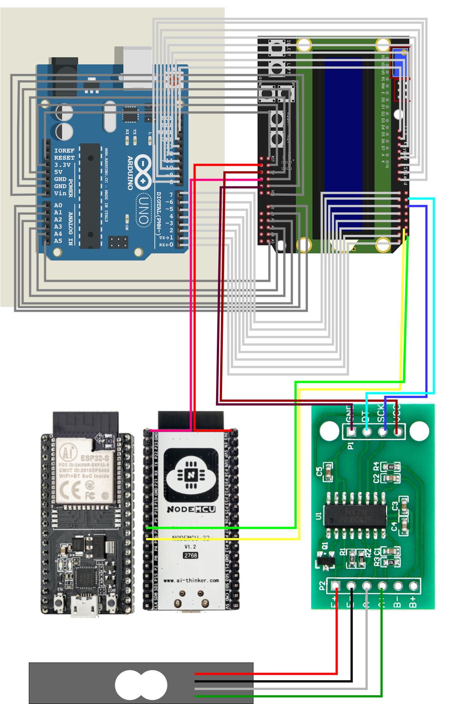

# 目錄
* [背景](#背景)
* [目標](#目標)
* [方法](#方法)
* [安裝方法](#安裝方法)
* [程式碼](#程式碼)
	* [程式碼一](#程式碼一)
	* [程式碼二](#程式碼二)
* [操作說明](#操作說明)

# 背景
亞輪（Arim）是一間做輪框工廠的公司，每日須生產許多腳踏車的輪框，然而統計產量還是依靠人工抄寫，無法作到立即回報數量的功能，統計也浪費了許多時間。好在相同規格的輪框，重量可視為一致，利用此特性便能從

$$ \frac{總重量}{單一輪框數量}=數量$$

的特性得到產量。

# 目標
發明一個小型的物聯網，利用感測器取得總重量以及數量，並將結果回傳至資料庫。

# 方法
利用Load Cell與HX711，獲得待測物的重量，將重量上傳至Arduino，Arduino會將重量換算成數量，將結果顯示在LCD上。如果重量與數量正確，則可選擇將重量與數量傳至ESP32，ESP32具有連上網路的功能，連上網後，能將數據利用Google App Script提供的街口，上傳至Google Sheet。

# 安裝方法

* 簡單來說，就是將LCD Keypad Shield 直接插上Arduino Uno，此時LCD Keypad Shield變成Arduino Uno的擴增板，右上角的7個Pin腳分別是「pin 0, pin 1, pin 2, pin 3, pin 11, pin 12, pin 13」。
* Esp32的pin 16 <--> LCD Keypad Shield的pin 1。
* ESP32的pin 17 <--> LCD Keypad Shield的pin 0。
* ESP32的pin GNG <--> LCD Keypad Shield的pin GND。
* ESP32的pin3.3V <--> LCD Keypad Shield的pin 3.3V。
* HX711的GND <--> LCD Keypad Shield的pin GND。
* HX711的DT <--> LCD Keypad Shield的pin 12。
* HX711的SCK <--> LCD Keypad Shield的pin 11。
* HX711的VCC <--> LCD Keypad Shield的pin 5V。
* HX711的E+ <--> Load Cell的紅線
* HX711的E- <--> Load Cell的黑線
* HX711的A- <--> Load Cell的白線
* HX711的A+ <--> Load Cell的綠線


# 程式碼
由於客戶想要知道我們的程式能不能分辨現在架上是用那一種輪框，也就是說，當架上有輪框A與輪框B時，能不能分別做出檢測，因此有兩組程式。
第一組程式能夠判斷現在架上的總重量，並除以某種輪框的單位重量，以換算成數量。
第二組程式能夠判斷現在架上的重量改變，以此來判斷現在放上去或拿下來的輪框是哪一種。

## 程式碼一
Arduino 端
```
#include <LiquidCrystal.h>
#include "HX711.h"

//LCD使用到的PIN腳
const int pin_RS = 8; 
const int pin_EN = 9; 
const int pin_D4 = 4; 
const int pin_D5 = 5; 
const int pin_D6 = 6; 
const int pin_D7 = 7; 

//HX711使用到的PIN腳
const int DT_PIN = 12;
const int SCK_PIN = 11;

/*
重量的比例參數
HX711測到的是「電流」
將電流訊號轉換成重量的比例
由於沒有真實重量的值，下面的比例是我亂寫的
*/
const int scale_factor = 100;

//填入正確的PIN腳，建立LCD物件
LiquidCrystal lcd( pin_RS,  pin_EN,  pin_D4,  pin_D5,  pin_D6,  pin_D7);

//建立HX711物件
HX711 scale;

void setup() {
  Serial.begin(9600);
	scale.begin(DT_PIN, SCK_PIN);
  
  //稱重功能初始化，並將資訊顯示在LCD上
	lcd.begin(16, 2);
	lcd.setCursor(0,0);
	lcd.print("Measure Weight");
	lcd.setCursor(0,1);
	lcd.print("Initializing...");
	scale.set_scale(scale_factor);
	scale.tare();
  
  //稱重功能初始化完成，將資訊顯示在LCD上
  lcd.clear();
	lcd.setCursor(0,0);
	lcd.print("Measure Weight");
	lcd.setCursor(0,1);
	lcd.print("Finishing");
	delay(1000);  
}

void loop() {
  //weight是load cell與 HX711 得到的數據取十次平均
	int weight = scale.get_units(10);

  //由於可能發生校正沒校好，導致weight出現負數，可能導致後面出現Bug，所以要是出現負數，就將weight設為0
	if(weight < 0){
		weight = 0;
	}

  //將weight顯示在LCD上
	lcd.clear();
  lcd.setCursor(0, 0);
	lcd.print("Weight:");
	lcd.setCursor(7,0);
	lcd.print(weight);

  //經測試，一個輪框的weight約440，故將weight / 440，可以得到數量num
	int num = weight/440;
  //將num顯示在LCD
  lcd.setCursor(0, 1);
  lcd.print("num:");
  lcd.setCursor(4, 1);
  lcd.print(num);

  //讀取Keypad Shield的資訊

  int x;
  x = analogRead (0); //讀取A0的值
  lcd.setCursor(0,1); //把游標移到第2行第1個字
  if (x < 60){        //Right Buttom
    lcd.print ("send! ");
    Serial.println(weight);
    Serial.print(num);
  }else if (x < 200){ //Up Buttom
    //Do nothing
  }else if (x < 400){ //Down Buttom
    //Do nothing
  }else if (x < 600){ //Left Buttom
    //Do nothing
  }else if (x < 800){ //Select Buttom
    //Do nothing
  }
  delay(500); 
} 
```


Esp32 端
```
#include <WiFi.h>
#include <HTTPClient.h>

#define RXD1 16
#define TXD1 17

const char* ssid = "wifi名稱"; //輸入wifi ssid
const char* password = "wifi密碼"; //輸入wifi 密碼

// The URL key of GAS of Google sheet
String GAS = "GAS部屬後會獲得網址";

const byte numChars=32;
char receivedChars[numChars];

String String0; //從Arduino 接收到的String
String String1; //String0的前半部，代表weight
String String2; //String0的後半部，代表num
int weight;
int num;

void setup() {
  Serial.begin(115200);
  Serial1.begin(9600, SERIAL_8N1, RXD1, TXD1);

  WiFi.begin(ssid, password);
  //wifi 初始化
  while (WiFi.status() != WL_CONNECTED) {
    delay(500);
    Serial.print(".");
  }
  Serial.println("");
  Serial.print("Connecting to ");
  Serial.println(ssid);
  Serial.println("");
  Serial.println("STAIP address: ");
  Serial.println(WiFi.localIP());  
}

void loop() {
  //wifi connected enter
  if ((WiFi.status() == WL_CONNECTED)) {
    // start working..
    Serial.println("=================================");
    //持續監聽序列埠，若有string傳進來，將內容切成weight與num
    while(true){
      if (Serial1.available()){
        if(Serial1.available()){
          Serial.println("The message from Arduino Uno:");
          String0 = Serial1.readString();
          String1 = String0.substring(0, String0.indexOf("\n"));
          String2 = String0.substring(String0.indexOf("\n") + 1, String0.length());
          weight = String1.toInt();
          num = String2.toInt();
          break;
        }
      }
    }
  }
  
  String GASurl = GAS + "?weight="+String((int)weight)+"&num="+String((int)num);
  HTTPClient http;
  Serial.print("===HTTP Send data to Google===\n");
  http.begin(GASurl);
  Serial.print("===HTTP GET Status===\n");
  int httpCode = http.GET(); //Get status
          if(httpCode > 0) {
            Serial.printf("HTTP to get Feeback status: %d\n", httpCode);
            if(httpCode == HTTP_CODE_OK) {
                String payload = http.getString();
                Serial.println(payload); //印出feedback字串
            }
            else {
            Serial.printf("HTTP to get Feedback failed, error: %s\n", http.errorToString(httpCode).c_str());
            }
          Serial.println("=================================");
          http.end();
        }
    delay(30000);//30秒傳送一次，傳送資料最少20~30秒，勿低於30秒   
}
```

Google Sheet 的 Google App Script
```
var sheet_id = "XXX填入google sheet網址.../d/到/edit...這段的內容"; 
var sheet_name = "工作表名稱（下面那個工作表名稱）"; 

function doGet(e){ 
  var ss = SpreadsheetApp.openById(sheet_id); 
  var sheet = ss.getSheetByName(sheet_name); 
  
  var weight = Number(e.parameter.weight); 
  var num = Number(e.parameter.num)
  
  var date = new Date()
  var current_month = Number(date.getMonth()+1);
  var current_day = Number(date.getDate());
  var current_hour = Number(date.getHours());
  var current_minute = Number(date.getMinutes());

  sheet.appendRow([current_month, current_day, current_hour, current_minute, weight, num]); 
}
```


## 程式碼二
Arduino 端
```
#include <LiquidCrystal.h>
#include "HX711.h"

//LCD使用到的PIN腳
const int pin_RS = 8; 
const int pin_EN = 9; 
const int pin_D4 = 4; 
const int pin_D5 = 5; 
const int pin_D6 = 6; 
const int pin_D7 = 7; 

//HX711使用到的PIN腳
const int DT_PIN = 12;
const int SCK_PIN = 11;

/*
重量的比例參數
HX711測到的是「電流」
將電流訊號轉換成重量的比例
由於沒有真實重量的值，下面的比例是我亂寫的
*/
const int scale_factor = 100;

//填入正確的PIN腳，建立LCD物件
LiquidCrystal lcd( pin_RS,  pin_EN,  pin_D4,  pin_D5,  pin_D6,  pin_D7);

//建立HX711物件
HX711 scale;

//紀錄上一筆weight，由於weight訊號可能會有小幅度的上下跳動，所以紀錄上一筆的weight
//如果 weight 與 last_weight 差異太小，就當作是誤差，不理它
int last_weight = 0;
//如果weight長期沒有改變，就當作訊號穩定了
//這裡的「長期」，是指重複兩次
int timer = 2;
//顯示出來的weight，因為weight會有各種誤差，需要經過穩定確認才能確定這是我們要的weight
int present_weight = 0;
//上一筆present_weight，用來計算真的重量差，
int last_present_weight = 0;
//總數
int num = 0;
//兩種輪框的個別數量
int nums[2] = {0, 0};

void setup() {
  Serial.begin(9600);
	scale.begin(DT_PIN, SCK_PIN);
  
  //稱重功能初始化，並將資訊顯示在LCD上  
	lcd.begin(16, 2);
	lcd.setCursor(0,0);
	lcd.print("Measure Weight");
	lcd.setCursor(0,1);
	lcd.print("Initializing...");
	scale.set_scale(scale_factor);
	scale.tare();

  //稱重功能初始化完成，將資訊顯示在LCD上	
  lcd.clear();
	lcd.setCursor(0,0);
	lcd.print("Measure Weight");
	lcd.setCursor(0,1);
	lcd.print("Finishing");
	delay(1000);
}

void loop() {
  //取得重量訊號
	int weight = scale.get_units(10);
  //如果因為校正沒有做好，導致訊號變成負的，可能會導致bug，所以做這個防呆
	if(weight < 0){
		weight = 0;
	}
  //穩定檢查，先去掉變化太少的雜訊，然後當數據重複兩次了，它才會更新呈現出來的訊號
  if(weight != last_weight){  //如果weight發生了改變
    if(weight - last_weight > 5 || weight - last_weight < 5){ //但改變的幅度太小
      timer = 2;
    }else{  //改變的夠大
      timer--;
      if(timer == 0){
        timer = 2;
        present_weight = weight;
      }
    }
  }else{
    timer--;
    if(timer == 0){
      timer = 2;
      present_weight = weight;
    }
  }  
  
  if(present_weight - last_present_weight > 460 && present_weight - last_present_weight < 485){
    nums[0]++;
    num++;
  }else if(present_weight - last_present_weight > 485 && present_weight - last_present_weight < 520){
    nums[1]++;
    num++;
  }else if(present_weight - last_present_weight < -485 && present_weight - last_present_weight > -520){
    nums[1]--;
    num--;
  }else if(present_weight - last_present_weight < -460 && present_weight - last_present_weight > -485){
    nums[0]--;
    num--;
  }
  //輸出Num A 到LCD  
  lcd.clear();
  lcd.setCursor(0, 0);
	lcd.print("Num A:");
	lcd.setCursor(7,0);
	lcd.print(nums[0]);
  //輸出Num B 到LCD
  lcd.setCursor(0, 1);
  lcd.print("Num B:");
  lcd.setCursor(7, 1);
  lcd.print(nums[1]);
	
  int x;
  x = analogRead (0);  //讀取A0的值
  lcd.setCursor(0,1); //把游標移到第2行第11個字
  if (x < 60){
    lcd.print ("send! ");
    Serial.println(present_weight);
    Serial.println(num);
    Serial.println(nums[0]);
    Serial.print(nums[1]);
  }
  last_weight = weight;
  if(last_present_weight != present_weight){
    last_present_weight = present_weight;
  }
  delay(500); 
} 
```


ESP32 端
```
#include <WiFi.h>
#include <HTTPClient.h>

#define RXD1 16
#define TXD1 17

const char* ssid = "wifi名稱"; //輸入wifi ssid
const char* password = "wifi密碼"; //輸入wifi 密碼

String GAS = "GAS部屬後會獲得網址";

const byte numChars=32;
char receivedChars[numChars];

String String0;
String String1;
String String2;
String String3;
String String4;
String String5;
String String6;

int weight;
int num;
int num_A;
int num_B;

void setup() {
  Serial.begin(115200);
  Serial1.begin(9600, SERIAL_8N1, RXD1, TXD1);

  WiFi.begin(ssid, password);
  //wifi 初始化
  while (WiFi.status() != WL_CONNECTED) {
    delay(500);
    Serial.print(".");
  }
  Serial.println("");
  Serial.print("Connecting to ");
  Serial.println(ssid);
  Serial.println("");
  Serial.println("STAIP address: ");
  Serial.println(WiFi.localIP());  
}

void loop() {
  //wifi connected enter
  if ((WiFi.status() == WL_CONNECTED)) {
    // start working..
    Serial.println("=================================");
    while(true){
      if (Serial1.available()){
        if(Serial1.available()){
          Serial.println("The message from Arduino Uno:");
          String0 = Serial1.readString(); //所有送來的訊號
          String1 = String0.substring(0, String0.indexOf("\n"));  //第一筆訊號：重量
          String2 = String0.substring(String0.indexOf("\n") + 1, String0.length()); 
          String3 = String2.substring(0, String2.indexOf("\n"));  //第二筆訊號：總數量
          String4 = String2.substring(String2.indexOf("\n") + 1, String2.length());
          String5 = String4.substring(0, String4.indexOf("\n"));  //第三筆訊號：A的訊號
          String6 = String4.substring(String4.indexOf("\n") + 1, String4.length());//第四筆訊號：B的訊號
          weight = String1.toInt();
          num = String3.toInt();
          num_A = String5.toInt();
          num_B = String6.toInt();
          break;
        }
      }
    }
  }
  
  
  
  String GASurl = GAS + "?weight="+String((int)weight)+"&num="+String((int)num)+"&num_A="+String((int)num_A)+"&num_B="+String((int)num_B);
  HTTPClient http;
  Serial.print("===HTTP Send data to Google===\n");
  http.begin(GASurl);
  Serial.print("===HTTP GET Status===\n");
  int httpCode = http.GET(); //Get status
          if(httpCode > 0) {
            Serial.printf("HTTP to get Feeback status: %d\n", httpCode);
            if(httpCode == HTTP_CODE_OK) {
                String payload = http.getString();
                Serial.println(payload); //印出feedback字串
            }
            else {
            Serial.printf("HTTP to get Feedback failed, error: %s\n", http.errorToString(httpCode).c_str());
            }
          Serial.println("=================================");
          http.end();
        }
    delay(30000);//30秒傳送一次，傳送資料最少20~30秒，勿低於30秒   
}
```

Google Sheet 的 Google App Script
```
var sheet_id = "XXX填入google sheet網址.../d/到/edit...這段的內容"; 
var sheet_name = "工作表名稱（下面那個工作表名稱）"; 

function doGet(e){ 
  var ss = SpreadsheetApp.openById(sheet_id); 
  var sheet = ss.getSheetByName(sheet_name); 
  
  var weight = Number(e.parameter.weight); 
  var num = Number(e.parameter.num)
  var num_A = Number(e.parameter.num_A)
  var num_B = Number(e.parameter.num_B)
  
  var date = new Date()
  var current_month = Number(date.getMonth()+1);
  var current_day = Number(date.getDate());
  var current_hour = Number(date.getHours());
  var current_minute = Number(date.getMinutes());

  sheet.appendRow([current_month, current_day, current_hour, current_minute, weight, num, num_A, num_B]); 
}
```


# 操作說明
## 程式碼一
將產品隨意的擺到架上，在重量不超過Load Cell的承重上限下，不論一次擺上幾個都沒關係，當要上傳重量與數量時，按下LCD Keypad Shield的Right，可能要按住，一小段時間，它可能不會馬上反應，直到LCD上出現Send字樣，代表成功發送至Google sheet，而Google Sheet要更新資料也需要一小段時間。

## 程式碼二
類似程式碼一，只是**產品不能隨機的擺到架上，由於他是偵測重量的改變，所以一次只能改變一個輪框**，也就是說，一次只能放上去一個或拿下一個。
